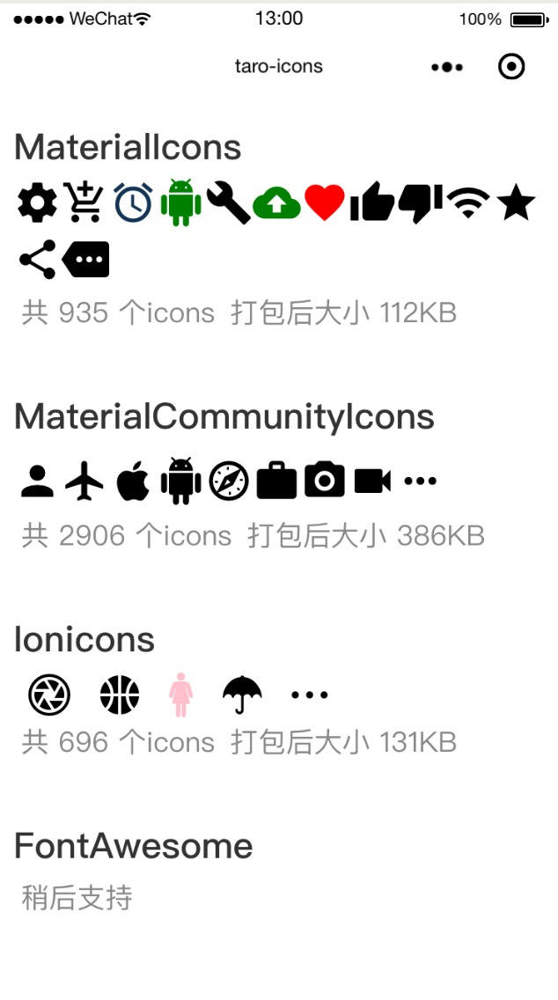

# taro-icons
基于 Taro 的小程序图标库



## 特性
* 按需加载，根据自身需要选择加载不同的图标库，减少包大小
* 大约 6000 个 icon 可供选择

## 支持的图标库:
- [x] [Ionicons](https://ionicons.com/) (v4.4.4, 696 icons,  ～131KB)
- [x] [MaterialIcons](https://material.io/tools/icons/) (v3.0.1, 935 icons, ～112KB)
- [x] [MaterialCommunityIcons](https://materialdesignicons.com/)  (v2.8.94, 2906 icons, ～386KB)
- [x] [FontAwesome](https://fontawesome.com/) (v5.4.2, 1391 icons, ~298KB)

## 安装
```shell
npm install taro-icons --save
```
## 使用
在 `app.js` 中导入你需要的图标库`scss` 文件，如 `MaterialIcons`:
```js
// app.js
// 请根据需要选择导入的 scss，这里全部导入
import 'taro-icons/scss/MaterialCommunityIcons.scss' // 386KB
import 'taro-icons/scss/MaterialIcons.scss' // 112KB
import 'taro-icons/scss/Ionicons.scss' // 131KB
import 'taro-icons/scss/FontAwesome.scss' // 298KB
```

然后在需要用到图标的地方引入对应d的`component`使用:
```js
import {
  MaterialIcons,
  MaterialCommunityIcons,
  Ionicons,
  FontAwesome,
} from 'taro-icons';
...

<MaterialIcons name='settings' size={24} color='#000000' />
<MaterialCommunityIcons name='account' size={32} color='#000000' />
<Ionicons name='ios-woman' size={32} color='pink' />
<FontAwesome family='brands' name='weixin' size={32} />
```
其中`name`必填，可以在对应的网站上找到  
具体用法请参考 `example`

## Icon props
| 属性 | 说明 | 类型 | 默认值 |
| ------ | ------ | ------ | ------ |
| name | 需要显示的图标名称，可以在对应图标库网站找到 | String |  |
| size | 图标大小（px） | Number | 24 |
| color | 图标颜色 | String | #000000 |
| family | FontAwesome 特有属性(solid、regular、brands) | String | solid |

## ⚠️注意事项
在`微信开发者工具`中，选择 设置 -> 项目设置 -> 调试基础库，设置版本`2.2.3`及以上，图标才能正常显示
